# Étude préalable SEO & Stratégie Digital Marketing — GameMart

**Étudiant : MANAI Mohamed Amine**
**Projet : GameMart — application e-commerce de jeux vidéo (Angular 20)**
**Site déployé : https://gamemarttn.netlify.app/**
**Date : octobre 2026**

> Devoir : étude préalable du site, personas, recherche de mots-clés, audit SEO du site existant
> et stratégie SEO / Digital Marketing à mettre en place.
> Outils utilisés : Screaming Frog SEO Spider 24.3 (version gratuite, mode Liste), navigateur Edge,
> Google Search Console (préconisée), MozBar (préconisée). Aucune donnée inventée : les volumes et
> difficultés de mots-clés sont à vérifier avec Google Keyword Planner / Trends / Semrush / Ahrefs.

---

## Sommaire

1. [Étude préalable du site](#1-étude-préalable-du-site)
2. [Personas](#2-personas)
3. [Recherche de mots-clés](#3-recherche-de-mots-clés)
4. [Audit SEO du site existant](#4-audit-seo-du-site-existant)
5. [Stratégie SEO à mettre en place](#5-stratégie-seo-à-mettre-en-place)
6. [Stratégie Digital Marketing à mettre en place](#6-stratégie-digital-marketing-à-mettre-en-place)
7. [KPI, plan d'action et roadmap](#7-kpi-plan-daction-et-roadmap)
8. [Conclusion](#8-conclusion)
9. [Annexes](#9-annexes)

---

## 1. Étude préalable du site

### 1.1. Présentation du projet

**GameMart** est une application e-commerce moderne dédiée à la **vente de jeux vidéo sur PC**.
Technologies : Angular 20, TypeScript, RxJS, SCSS, API mock JSON Server. Fonctionnalités réelles :
page d'accueil avec banner de promotions et catégories, catalogue `/produits` filtrable et triable
(catégorie, prix, note, nouveautés, popularité), fiches produits `/produitDetails/:id` avec description,
carousel d'images et trailer YouTube, recherche instantanée, panier, checkout protégé, confirmation de
commande, espace utilisateur (profil, adresses, commandes, wishlist), authentification. Le catalogue
contient 40 jeux (ex. Cyberpunk 2077, Red Dead Redemption 2). Le site est déployé et accessible.

### 1.2. Problème, solution et proposition de valeur

- **Problème :** les joueurs perdent du temps à chercher un jeu au bon prix et à vérifier qu'il correspond
  à leurs goûts et à leur configuration ; les acheteurs « cadeau » (non-joueurs) sont perdus face au
  jargon (genres, PEGI, configurations).
- **Solution :** GameMart centralise le parcours — catalogue filtrable, recherche instantanée, fiches
  riches (trailer, note, stock, suggestions similaires), panier avec livraison calculée, checkout clair,
  suivi de commande, wishlist.
- **Proposition de valeur :** trouver, comparer et acheter rapidement un jeu PC grâce à un catalogue
  malin, des fiches riches et un parcours d'achat fluide.

### 1.3. Public cible et besoins

- **Cœur de cible :** 16-35 ans, joueurs PC francophones (France, Belgique, Suisse, Maghreb francophone),
  sensibles au prix, présents sur YouTube, TikTok, Discord.
- **Cible secondaire :** parents et proches (25-50 ans) qui achètent un jeu en cadeau.
- **Besoins :** prix lisibles et promos visibles ; informations fiables avant achat ; filtres efficaces ;
  tunnel d'achat rassurant (livraison, paiement, retours, suivi) ; aide au choix (guides, tops, FAQ).

### 1.4. Positionnement digital, objectifs, canaux, opportunités et risques

- **Positionnement :** challenger « catalogue malin + fiches riches + bons plans », sans affronter les
  géants (Steam, Epic) sur le volume : gagner sur la longue traîne, les promos et l'aide au choix.
- **Objectifs SEO :** indexation propre à M2, top 20 sur 10 fiches pilotes à M6, page Promotions
  positionnée sur les requêtes prix, 8 articles publiés, résultats enrichis, Core Web Vitals au vert.
- **Objectifs Marketing :** premières ventes traçables, audience (réseaux + newsletter), réassurance
  (avis, FAQ), fidélisation (wishlist, comptes), publicité testée et rentable.
- **Canaux pertinents :** SEO/blog, Google Search, YouTube, TikTok, Instagram, Facebook (retargeting),
  email, Discord. Écartés : LinkedIn (B2B) et Google Business Profile (pas de magasin physique).
- **Opportunités :** longue traîne par titre, saisonnalité (soldes, Black Friday, Noël), vidéos
  (trailers déjà intégrés), rich snippets.
- **Risques :** SPA à rendu client (indexation fragile), concurrence dominatrice, catalogue limité,
  images externes hotlinkées, autorité nulle au lancement.

---

## 2. Personas

### Persona 1 — Yanis, 21 ans, étudiant gamer à petit budget

Étudiant de 21 ans jouant chaque semaine sur PC (RPG, action, mondes ouverts). **Objectifs :** acheter
au meilleur prix, repérer les promos, suivre ses envies (wishlist). **Besoins :** filtre prix, page
promos, prix et stock visibles. **Frustrations :** prix élevés, promos ratées, frais découverts au
panier, fiches sans trailer ni avis. **Comportements numériques :** Google + YouTube (gameplay),
Discord, comparateurs de prix ; smartphone (découverte) + PC (achat). **Réseaux :** YouTube, TikTok,
Discord, Instagram. **Recherches :** « acheter [titre] PC pas cher », « jeux vidéo pas cher »,
« code promo ». **Intentions :** transactionnelles et commerciales. **Freins :** boutique inconnue,
paiement/livraison flous.

### Persona 2 — Salma, 34 ans, mère qui offre un jeu en cadeau

Salariée de 34 ans, non-joueuse, achète pour offrir. **Objectifs :** choisir un jeu adapté sans se
tromper, commander simplement, être livrée à temps. **Besoins :** guides cadeaux en langage simple,
FAQ (livraison, retours, paiement). **Frustrations :** jargon gaming, peur de se tromper, retours
compliqués. **Comportements :** Google en langage naturel, Facebook/Instagram, avis clients ;
smartphone en priorité. **Recherches :** « quel jeu offrir ado », « comment choisir un jeu vidéo ».
**Intentions :** informationnelles puis commerciales. **Freins :** manque de confiance, infos
techniques incompréhensibles.

### Persona 3 — Mehdi, 27 ans, passionné PC qui compare tout

Salarié de 27 ans, joueur PC exigeant. **Objectifs :** acheter en connaissance de cause, suivre
nouveautés et notes. **Besoins :** fiches exhaustives (trailer, note, configuration requise,
suggestions similaires), tris nouveautés/popularité, comparatifs. **Frustrations :** descriptions
minces, notes non expliquées, pas de config requise. **Comportements :** Google avancé, YouTube
(tests), Reddit/Discord/forums ; PC + smartphone. **Recherches :** « avis [titre] 2026 »,
« top RPG PC », « comparatif boutiques jeux ». **Intentions :** informationnelles et commerciales
expertes. **Freins :** contenu générique, absence de preuves.

---

## 3. Recherche de mots-clés

Méthode : intentions alignées sur les 3 personas et les pages réelles (`/`, `/produits`,
`/produitDetails/:id`, `/search`, tunnel d'achat). Marché FR prioritaire, EN secondaire.
Fichier d'exploitation : `docs/seo-keywords.csv` (38 mots-clés). Légende : INF = informationnelle,
NAV = navigationnelle, COM = commerciale, TRA = transactionnelle ; P0 = critique → P3 = faible.

### 3.1. Mots-clés principaux et secondaires

| Mot-clé | Intention | Persona | Page cible | Priorité |
|---|---|---|---|---|
| acheter jeux vidéo en ligne | TRA | Yanis, Salma | `/produits` | P0 |
| boutique jeux vidéo en ligne | TRA/COM | Yanis, Salma | `/` puis `/produits` | P0 |
| jeux vidéo pas cher | TRA/COM | Yanis | `/produits` + `/promotions` (à créer) | P0 |
| jeu RPG PC / jeu aventure monde ouvert / jeu action PC | COM/TRA | Yanis, Mehdi | `/produits` (facettes à créer) | P1 |
| jeux en promo, nouveautés, top ventes | TRA/COM | Yanis, Mehdi | `/promotions`, `/produits` | P0/P1 |

### 3.2. Longue traîne, informationnels, navigationnels, commerciaux, transactionnels

- **Longue traîne (P1) :** « acheter cyberpunk 2077 PC pas cher », « jeu RPG futuriste monde ouvert
  PC », « quel jeu offrir à un ado gamer », « jeu pas cher petit budget étudiant » → fiches produits
  et articles ciblés, faible concurrence, forte conversion.
- **Informationnels (P1) :** « top jeux RPG 2026 », « meilleurs jeux monde ouvert PC », « comment
  choisir un jeu vidéo PC », « soldes jeux vidéo dates 2026 » → blog et guides.
- **Navigationnels (P0) :** « gamemart », « gamemart catalogue », « gamemart avis » → accueil,
  catalogue, page avis (marque à construire).
- **Commerciaux (P0/P1) :** « meilleur site pour acheter jeux PC », « comparatif boutique jeux vidéo
  en ligne » → comparatifs honnêtes et preuves.
- **Transactionnels (P0) :** « acheter [titre du jeu] PC » (une fiche par jeu), « code promo
  gamemart », « commander jeu vidéo en ligne livraison » → fiches, page promos, page livraison.
- **Questions fréquentes :** « Où acheter des jeux vidéo pas chers ? », « Quel jeu offrir ? »,
  « Comment savoir si un jeu tourne sur mon PC ? », « Livraison et retours ? » → FAQ (schema FAQPage).
- **Anglais (P2/P3, si version EN future) :** « buy video games online », « cheap PC games »,
  « best open world games PC », « best place to buy PC games ».

### 3.3. Correspondance Persona → Intention → Mot-clé → Contenu → Page

| Persona | Intentions | Exemples | Contenu | Page cible |
|---|---|---|---|---|
| Yanis | TRA + COM (prix) | jeux pas cher, code promo | Page promotions, fiches prix/stock | `/promotions`, fiches |
| Salma | INF + COM (rassurance) | quel jeu offrir, livraison | Guides cadeaux, FAQ, pages services | `/blog/*`, pages services |
| Mehdi | INF + COM (expertise) | top RPG, avis, comparatif | Tests, tops, fiches riches | `/blog/*`, fiches |

---

## 4. Audit SEO du site existant

### 4.1. Méthode et périmètre

Audit réalisé sur le site déployé avec **Screaming Frog SEO Spider 24.3 (version gratuite, mode
Liste)** : crawl des 42 URL du sitemap en HTML brut (sans JavaScript), complété par un test
navigateur. Captures : `docs/audit-screenshots/` (8 PNG + 5 CSV). Niveaux : Critique, Haute,
Moyenne, Faible.

### 4.2. SEO technique — résultats

| Problème (outil) | Impact SEO | Priorité | Recommandation |
|---|---|---|---|
| SPA 100 % client-side : H1 (42/42) et images (0 détectée) invisibles en HTML brut — Fig. 04, 05 | Indexation lente/partielle du catalogue | Critique | Activer le SSR Angular (`@angular/ssr`) ou pré-rendu |
| Aucun canonical (42/42 manquants — Fig. 07), `lang="en"` pour un contenu FR | Signaux faux, duplication future des facettes | Haute | `lang="fr"`, canonical par page, `noindex` facettes |
| URLs `/produitDetails/:id` (ID seul, camelCase, sans slug) | CTR et classement faibles | Haute | Migrer vers `/jeux/:slug-:id` + redirections 301 |
| Fausse fiche `/produitDetails/9999` servie en HTTP 200 (Fig. 08) | Soft-404, budget crawl gaspillé | Moyenne | Vraie 404 pour ID inconnus |
| `robots.txt` absent avant l'étude ; aucun sitemap avant l'étude | Crawl incontrôlé, découverte lente | Haute | **Fait : `robots.txt` + `sitemap.xml` (42 URL) déployés** |
| CDN bloquants, images externes hotlinkées sans dimensions | LCP/CLS dégradés | Haute | Self-hébergement, WebP, lazy-load, `alt` |
| Aucune donnée structurée ; maillage interne pauvre | Pas de rich snippets, crawl profond faible | Moyenne | JSON-LD (Product, FAQ, Breadcrumb), breadcrumbs, footer |

### 4.3. SEO On-Page — résultats

| Problème (outil) | Impact SEO | Priorité | Recommandation |
|---|---|---|---|
| Title unique « ECommerce » sur les 42 pages (Fig. 01 : doublon 100 %) | Aucun classement ni CTR | Critique | Titles uniques par gabarit (TitleStrategy Angular) |
| 0 meta description sur 42 pages (Fig. 03 : manquant 100 %) | Extraits auto, CTR faible | Haute | Descriptions 150-160 caractères par page |
| Pas d'Open Graph / Twitter Cards | Partages sociaux sans visuel | Moyenne | Balises OG + Twitter par page |
| Contenus minces (descriptions brutes, pas de textes catégories) | Thin content | Haute | Intros catégories + fiches enrichies (avis, FAQ, config) |
| Images sans `alt`, slugs absents, pas de pages services ni FAQ | SEO image nul, intentions non captées | Haute | `alt` descriptifs, slugs FR, pages livraison/retours/FAQ |

### 4.4. SEO Off-Page — résultats

Domaine récent, autorité quasi nulle (baseline PA/DA ≈ 1), 0 backlink, aucun profil social officiel.
Stratégie : profils officiels homogènes, contenus citables (tops, calendriers, guides), 2-3
partenariats micro-streamers/blogs, collecte d'avis post-achat via tiers (Trustpilot). Interdits :
achat de liens, faux avis, spam.

### 4.5. Preuves d'audit (captures d'outils)

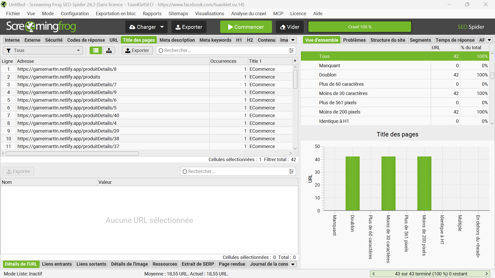

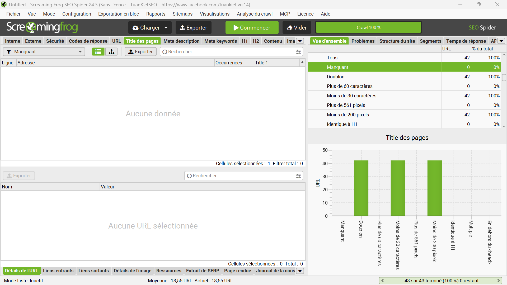

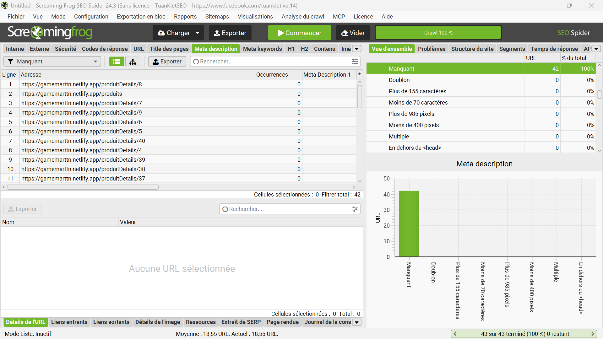

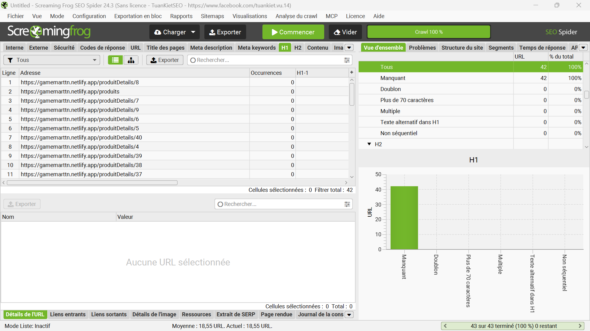

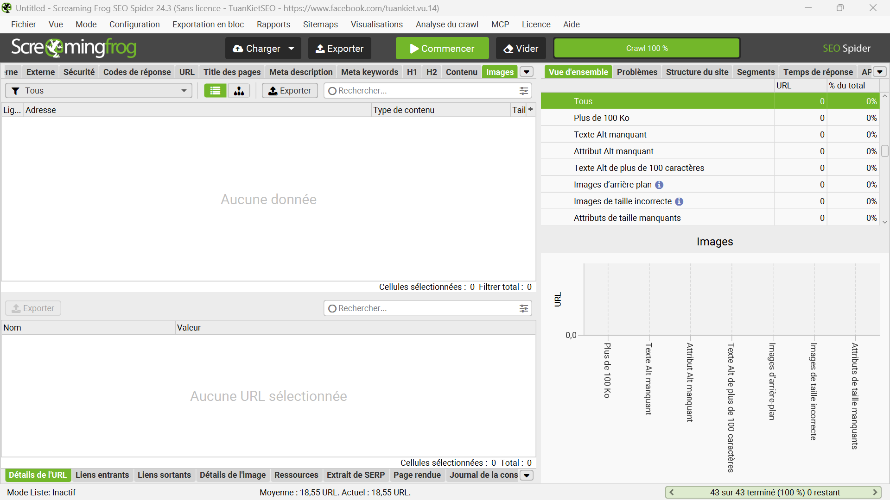

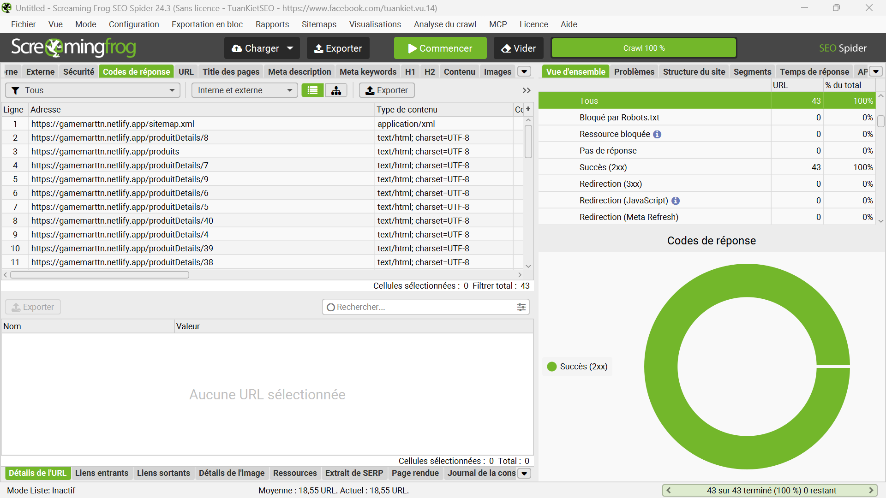

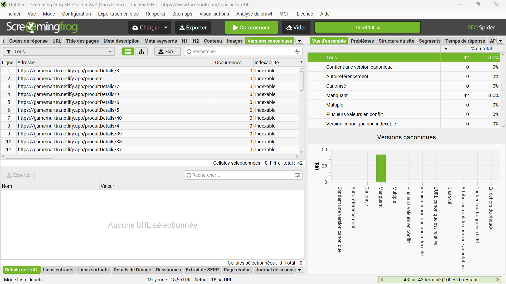

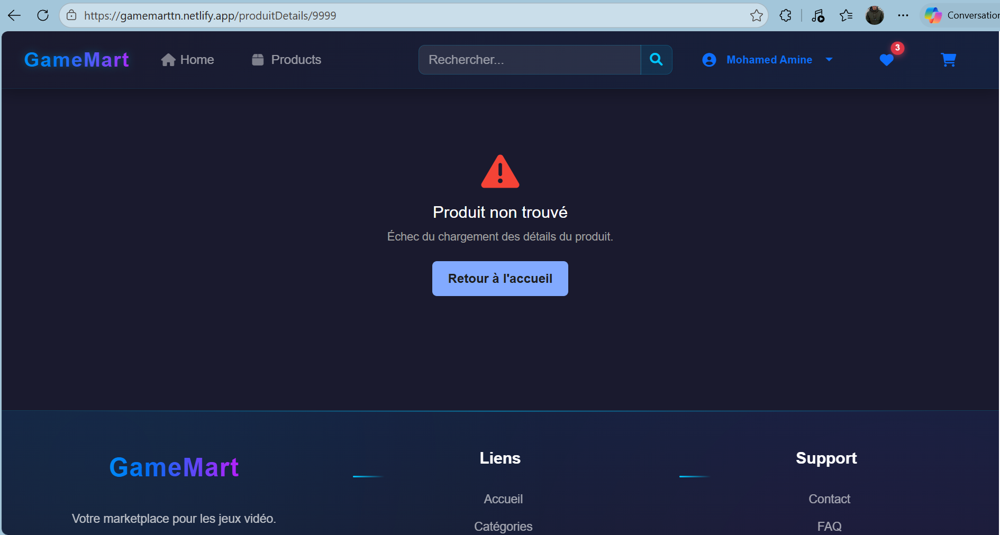

### 4.6. Preuves PageSpeed Insights (outil officiel Google, mobile, octobre 2026)

| Métrique | Accueil `/` | Fiche `/produitDetails/1` | Cible Google | Problème confirmé |
|---|---|---|---|---|
| Performance | 76 (moyen) | **45** (faible) | ≥ 90 | T-7 / T-8 |
| LCP (affichage du visuel principal) | 5,2 s | **15,6 s** | < 2,5 s | T-8 (images externes lourdes) |
| CLS (stabilité visuelle) | 0 (bon) | **0,563** (mauvais) | < 0,1 | Images sans dimensions |
| TBT / Speed Index | 0 ms / 3,5 s | 110 ms / 4,7 s | — | JS + payloads lourds |
| Images à optimiser | −23 Mo | **−61 Mo** (payload total ~25 Mo) | — | T-8 |
| SEO | 92 : **« Document does not have a meta description »** | 92 : idem | 100 | O-2 (confirmé par Google) |
| Accessibilité | 96 (headings désordonnés) | 74 (boutons/formulaires sans labels, headings) | — | O-4 + quick wins |

Lecture : la fiche produit — page la plus importante pour la vente — est la plus lourde (carrousel
d'images externes + trailer YouTube, sans dimensions ni compression). Google lui-même signale la meta
description absente : la preuve ne vient plus seulement de notre crawl, mais de l'outil de référence.

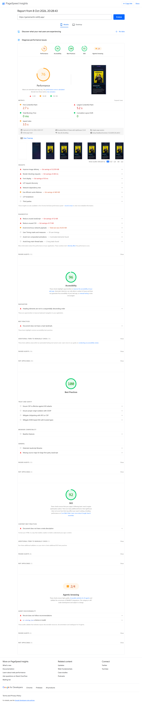



### 4.7. Preuves MozBar (autorité et concurrence, octobre 2026)

Mesures sur le site (compte gratuit) : **Domain Authority 93 / Page Authority 44 / Links to Page 0**.
Nuance critique : le DA 93 est celui de l'hébergeur mutualisé `netlify.app`, pas celui de GameMart ;
avec **0 lien entrant**, l'autorité propre du projet part de zéro et un futur domaine personnalisé
démarrerait à DA ≈ 1 — d'où la priorité donnée au netlinking dans la roadmap (M1-M6).

Relevé SERP « acheter jeux vidéo PC pas cher » (MozBar) : Reddit DA 92, G2A DA 85 (121 liens),
Eneba DA 82, Instant Gaming DA 81, Rakuten DA 91 — contre 0 lien pour GameMart. Conclusion : affronter
ces acteurs sur les requêtes génériques est illusoire ; la stratégie longue traîne (§3) est validée.
Signaux positifs relevés sur la même SERP : `pcmasterrace.fr` (DA 5) classé en page 1 — un petit site
peut ranker par le contenu ciblé ; un encadré IA Google cite déjà des concurrents (prérequis : contenu
structuré + FAQ pour y figurer) ; un pack local de boutiques gaming à Tunis et un thread Reddit de
recommandation ouvrent des pistes (SEO local, présence Reddit/Discord).

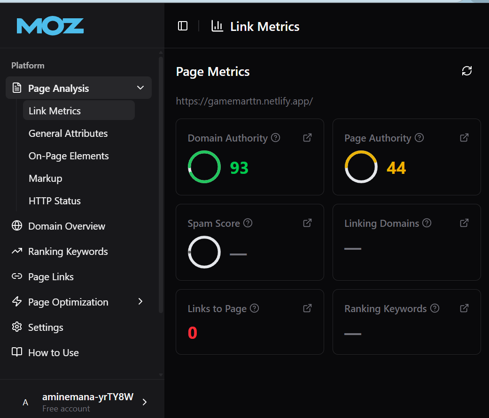

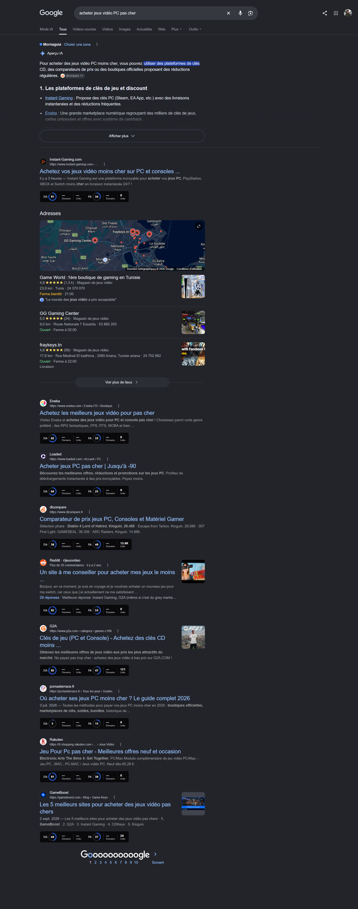

---

## 5. Stratégie SEO à mettre en place

1. **Technique :** SSR/pré-rendu, `robots.txt` + `sitemap.xml` (déjà déployés, à déclarer en Search
   Console), URLs en slugs `/jeux/:slug-:id` + 301, canonical + `lang="fr"`, vraie 404, images WebP
   + `alt`, JSON-LD (Organization, Product, Breadcrumb, FAQ, Article), HTTPS unique, performance
   (LCP < 2,5 s).
2. **Architecture :** `/`, `/produits`, catégories (`/jeux/rpg-pc`, `/jeux/monde-ouvert`…),
   `/promotions`, `/nouveautes`, `/top-ventes`, fiches `/jeux/:slug`, hub `/blog/`, pages services
   (`/livraison-paiement`, `/retours`, `/faq`, `/contact`), avec maillage bouclé
   accueil → catégories → fiches → guides.
3. **Contenu (12 semaines) :** 5 pages services + FAQ + 10 fiches pilotes (S1-S2) ; guides cadeaux
   (S3-S4) ; tops RPG/monde ouvert + catégories (S5-S6) ; petits prix/soldes + newsletter (S7-S8) ;
   test pilote + avis (S9-S10) ; comparatif + bilan Search Console (S11-S12).

---

## 6. Stratégie Digital Marketing à mettre en place

| Canal | Retenu ? | Objectif / contenu / fréquence | KPI |
|---|---|---|---|
| SEO / Content | Oui | Trafic qualifié → ventes (catégories + 8 articles + FAQ) | Trafic organique, positions, conversion |
| Google Search (ads ciblées) | Oui | Ventes J1 sur marque + titres | ROAS, CPA |
| YouTube | Oui | Trailers/tests, 1-2/sem. | Vues, clics fiches |
| TikTok | Oui | Bons plans, 3-5/sem. | Vues, clics UTM |
| Instagram / Facebook | Oui | Guides cadeaux, retargeting panier | Reach, ROAS retarget |
| Email | Oui | Bienvenue, panier abandonné, promos | Ouverture, conversion |
| Discord | Oui (léger) | Communauté, entraide | Membres actifs |
| LinkedIn / Google Business Profile | Non | Hors cible B2C / pas de magasin | — |

Messages : Yanis → prix/promos ; Salma → simplicité/réassurance ; Mehdi → expertise/transparence.

---

## 7. KPI, plan d'action et roadmap

**KPI :** indexation (Search Console), positions top 3/10/20, trafic organique (GA4), CTR, Core Web
Vitals, commandes/CA/panier moyen/conversion, abonnés et e-mail (ouverture, CA/e-mail), backlinks et
avis. Tableau de bord mensuel unique.

**Plan d'action (extrait P0/P1) :** domaine + HTTPS + Search Console/GA4 (P0) ; SSR + titles/metas
(P0) ; robots/sitemap (fait, P0) ; slugs + 301 (P1) ; pages services + FAQ (P1) ; `/promotions` + 10
fiches pilotes (P1) ; images/Vitals (P1) ; 8 articles + blog (P1) ; JSON-LD (P2) ; YouTube/TikTok +
newsletter (P2) ; avis + partenariats (P2) ; Ads test (P2) ; version EN (P3).

**Roadmap :** M1 fondations (indexable, mesurable) ; M2-M3 contenus qui vendent ; M3-M6 autorité et
acquisition ; M6+ pics saisonniers (soldes, Black Friday, Noël).

---

## 8. Conclusion

GameMart dispose d'un vrai produit (catalogue filtrable, fiches riches, tunnel complet) mais d'un
SEO de départ quasi nul, prouvé par l'outil : titles dupliqués, metas absentes, contenus invisibles
sans JavaScript, aucun canonical, soft-404. La stratégie proposée est adaptée et non générique :
corriger les fondamentaux (SSR, titles, sitemap déjà déployé), gagner la longue traîne par titre et
les intentions prix/cadeau/expertise des 3 personas, puis amplifier via YouTube, TikTok, e-mail et
partenariats. Sans invention de données : chaque métrique reste à valider avec les outils
professionnels après mise en ligne complète.

---

## 9. Annexes

- **Fichiers livrés dans le projet :** `robots.txt` + `public/robots.txt`, `sitemap.xml` +
  `public/sitemap.xml` (42 URL), `docs/seo-digital-marketing.md` (étude complète),
  `docs/seo-keywords.md` + `docs/seo-keywords.csv` (38 mots-clés FR/EN), `docs/audit-screenshots/`
  (12 captures + 5 exports CSV : Screaming Frog, PageSpeed, MozBar, navigateur).
- **Sources et outils :** code source du projet (`README.md`, routes, `api/db.json`), site déployé,
  Screaming Frog SEO Spider 24.3, PageSpeed Insights, MozBar, navigateur Edge ; données externes
  (volumes, difficultés, autorité) à vérifier avec Google Keyword Planner / Trends / Search Console /
  Semrush / Ahrefs.
